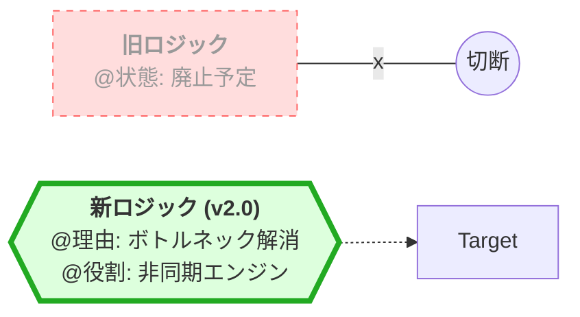
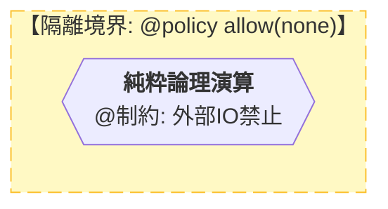

# CIP-Scriber 言語仕様書 (Version 2.0) - The Visual Manifest

## 1. 言語の核心的意図 (Core Philosophy)

CIP-Scriber v2.0は、Mermaidを基盤とし、人間とAIが「意図」を共有することで、実コードへの安全な橋渡しを行う。

* **レビュー負荷の最小化**: 「実装の細部」を図のアノテーションに追い出し、エンジニアは「論理フロー（絵）」と「意図（文字）」の不整合をチェックするだけで検証可能とする。
* **OSSリスクの物理一掃**: `subgraph` による境界定義と `policy` ブロックにより、AIによる無秩序なライブラリ導入を構造的に遮断する。
* **AIサボり防止**: 日本語の「文末確定性（SOV型）」を機能説明に用いることで、AIに論理の完結を促す。
* **意図による動的実装**: ターゲット言語固有の作法は、Markdownノード内の「概念定義」としてWorker AIに委託し、特定の言語仕様に依存しない設計図を実現する。

---

## 2. 構文規則 (Syntax Rules)

### 2.1 Mermaidへのアノテーション埋め込み

CIP-Scriber v2.0は、Mermaidの標準構文の中に、独自のメタデータ（アノテーション）をMarkdown形式で埋め込む。

* **Markdownノード (`{"内容"}`)**: 処理の具体名に加え、後述のアノテーション群を記述する主戦場。
* **サブグラフ (`subgraph`)**: 処理をグループ化し、後述する「セキュリティ境界（`policy`）」を適用する単位。

### 2.2 データ構造と状態の定義

処理フローの開始前に、システムが扱うデータ構造を定義する。

* **クラス図形式またはMarkdownノード**: `構造体名` :: { `フィールド`: 型 }。`@初期値` 等もここに記述する。

### 2.3 識別子の保護 (変数・構造体名)

Markdownノード内のテキストにおいて、変数名、関数名、構造体名などの識別子は、地の文との混同を避けるため、数式記法を応用した **ドルマーク ( $ )** で挟むことを推奨する。これによりMermaidのノード構文との干渉を防ぎつつ、レンダリング時に変数であることを視覚的に際立たせることができる。
例: `@理由:` `$通信パケット$` のサイズを検証する。

---

## 3. オープン・アノテーション (Open Annotation System)

Markdownノード内に記述し、設計側のAIから実装側のAIへ「実装の作法や意図」を伝達するためのメタデータ・フォーマット。

**基本ルール:**

*   フォーマットは **`@タグ名: 記述内容`** とする。
*   タグ名（xxxの部分）に厳密な予約語の制限はない。AIは文脈に応じて、後工程のコーディングAIに最も意図が伝わる的確なタグ名を自律的に選択・生成してよい。
*   ただし、システム全体の統一感とレビューのしやすさを保つため、以下の「代表的なタグ」を標準として優先的に使用すること。

**代表的な標準タグ:**

*   **`@理由:`** [必須級] なぜその論理やアーキテクチャにしたのかという根拠。レビューの最重要項目。
*   **`@実行:`** 副作用（IO、画面出力、通信、DB書き込み等）を伴うアクションの宣言。
*   **`@制約:`** リソース解放、メモリ境界、アトミック性などの絶対に破ってはならない物理的ルール。
*   **`@役割:`** 実行性質（アトミック、べき等、シングルトン等）、または継承・遵守すべきインターフェースの定義。
*   **`@戦略:`** 複雑な処理をAIに委譲する際のアルゴリズム指針（例：「〇〇のRFCに準拠せよ」）。
*   **`@policy:`** サブグラフ内で許可・制限するライブラリ（allow/restrict）の指定。

**状況に応じてAIが拡張してよいタグの例（柔軟性の担保）:**

*   **データの流れを示したい時**: `@入力:`, `@出力:`, `@フロー: A -> B -> C`
*   **状態の変化を示したい時**: `@状態遷移:`, `@事前条件:`, `@事後条件:`, `@分岐条件:`
*   **例外処理を示したい時**: `@例外:`, `@フォールバック:`

---

## 4. 抽象化粒度の決定基準 (Abstraction Levels)

| 記述レベル | 記述範囲 | 推奨される表現 |
| --- | --- | --- |
| **高位 (完全委譲)** | 業界標準（HTTP, AES等） | ノード名に機能名を書き、`@戦略` で仕様書を参照。 |
| **中位 (論理固定)** | 独自の業務ルール、交渉ロジック | Mermaidの分岐（`{ }`）を用いて条件と結果の関係を明文化。 |
| **低位 (詳細指示)** | 物理層、アトミック性、ビット演算 | Markdownノード内に `@制約` や `@例外` を詳細に記述。 |

---

## 5. 運用の目的とセキュリティモデル (Review & Security)

### 5.1 エンジニア・レビューの最適化

実コードでは冗長な構文に論理が埋没する。Scriber v2.0はこれらを視覚的なノードに分離することで、レビュー者が「言語の書き方」ではなく「設計の妥当性」の確認に集中できる環境を提供する。

### 5.2 OSS汚染防止（隔離フィルター）

AIが利便性のために外部の未承認ライブラリを導入することを、構造的に遮断する。

* **物理的な檻**: サブグラフごとに `@policy` を設定し、その範囲外のライブラリ使用を禁止する。
* **副作用の監視**: `@実行` が記述されているノードが `policy` 境界の外に出ていないかを厳格にチェックする。

---

## 6. 構文別アノテーション注入ルール (Micro-Rules)

AIは以下の構文を使用する際、必ず対応するアノテーションを注入すること。

| Mermaid構文 | アノテーションの役割 | 記述例 |
| --- | --- | --- |
| **単一ノード `[ ]`** | アクションの定義 | `["` **データ加工**    `@実行:` 物理メモリの平坦化 `"]` |
| **判定ノード `{ }`** | 論理的根拠 | `{"` **権限チェック**    `@理由:` 特権昇格攻撃の遮断 `"}` |
| **サブグラフ `subgraph`** | セキュリティ・物理境界 | `subgraph` 内に `@policy` (allow/restrict) を記述 |
| **戻り矢印 `-->`** | 反復・再帰の制御 | 戻り先に `@制約:` 脱出条件やスタック破棄を記述 |

---

## 7. ホワイトボード・ハック (Visual Refactoring Patterns)

既存システムの変更やモジュールの挿げ替えを表現するための視覚的テクニック。

### 7.1 モジュール挿げ替え (The Swapping Hack)

古い接続を切断し、新しいロジックをバイパスさせる。

### 7.2 セキュリティ境界の「檻」 (The Policy Cage)

信頼できない外部ライブラリやIOを特定のサブグラフに閉じ込める。

---

## 8. 運用ガイドライン (Usage Guide)

1. **文末確定性**: アノテーションの内容は「〜を検証する」「〜を破棄する」のように、AIに結末を宣言させること。
2. **識別子の保護**: 変数や関数名はドルマーク ( $ ) で挟み、地の文と分離すること。
3. **トポロジーの自由**: サンプルに固執せず、設計の物理構造（並列、再帰、階層）に合わせてMermaidの形を最適化すること。

